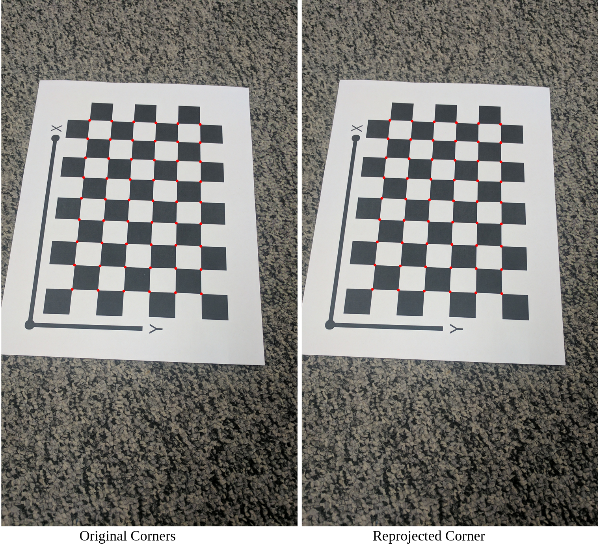

# AutoCalib - Zhang's Camera Calibration
Camera Calibration : Estimating the parameters of a camera including focal length, distortion coefficients, and principle point. 
## Method 
In this assignment, an automatic calibration method presented by Zhengyou Zhang[1] of Microsoft is implemented. The goal is estimate the the parameters fx, fy, cx, cy, k1, k2, where k1 and k2 are the radial distortion parameters and the camera calibration matrix (K) is given below:

```python
K  = [[fx, 0, cx],
      [ 0, fy,cy],
      [ 0, 0,  1]]
```

The method relies on a calibration target (a checkerboard) to estimate the intrinsic parameters. The steps implemented is described at [2].

## Results 

 

## How to Run 
```python
python3 wrapper.py
```
## Acknowledgement
This is an assignment done towards completion of RBE549 (Computer vision). 
Course website : https://rbe549.github.io/fall2022/hw/hw1/

## Reference
[1] https://www.microsoft.com/en-us/research/wp-content/uploads/2016/02/tr98-71.pdf  
[2] https://rbe549.github.io/fall2022/hw/hw1/
